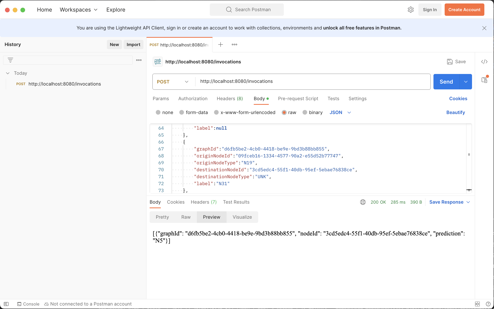

# Mendix Assignment Deployment

### AWS SageMaker Inference Structure
#### `inference.py`
#### Model Loading and Initialization
- The `model_fn` function is responsible for loading the model during inference. It loads the model from the specified path using the `load_model` function and sets it to evaluation mode.
- The `input_fn` function preprocesses the incoming request data. It reads the JSON input, extracts graph data, and processes it to create PyTorch Geometric `Data` objects for inference.
- The input is grouped by `graphId`, nodes and their attributes are extracted, and a PyTorch Geometric `Data` object is created for each graph.
#### Inference
- The `predict_fn` function performs the actual inference. It iterates through each prepared `Data` object, sends it to the model for prediction, and retrieves the predictions.
- These predictions are formatted as a list of dictionaries containing graph ID, node ID, and the predicted label.
#### Output Serialization
- The `output_fn` function serializes the predictions into a JSON format for the response.

### Deployment Configuration for SageMaker
#### `deploy.py`
#### Model Upload to S3
- The code begins by defining a function `upload_file` that uploads the model to an S3 bucket. It compresses the model folder using `compress_folder` from `compress.py` and uploads the compressed file to the specified S3 bucket.

#### SageMaker Model Deployment
- A PyTorchModel object is created using the `sagemaker.pytorch.PyTorchModel` class. This defines the configurations for deploying the model on SageMaker.
- The model configuration includes details such as the entry point for inference (`inference.py`), the source directory (`source_dir`), IAM role (`role`), model data location in S3 (`model_data`), framework version, Python version, and environment variables.
- The deployment mode (`local_mode`) is set to `True` for deploying the model locally on the current instance for testing purposes.
- `model.deploy()` method is used to initiate the deployment. It specifies the instance configuration, serializer, and deserializer for handling input and output data during inference.
```python
predictor = model.deploy(
    initial_instance_count=1,
    instance_type=instance_type,
    serializer=JSONSerializer(),
    deserializer=JSONDeserializer(),
)
```
### Local Endpoint Testing via POSTMAN
#### Example JSON Data
- The example JSON file includes multiple graph entries, each with specified `graphId`, `originNodeId`, `originNodeType`, `destinationNodeId`, `destinationNodeType`, and `label`. This JSON data format simulates the input structure expected by the deployed endpoint.
- 
```json
[
    {
        "graphId":"d6fb5be2-4cb0-4418-be9e-9bd3b88bb855",
        "originNodeId":"89713516-1d89-4711-ac7a-f9e8426eb14d",
        "originNodeType":"N19",
        "destinationNodeId":"b898bfea-5196-4a36-af29-3610cabe7f67",
        "destinationNodeType":"N31",
        "label":null
    },
    // ... (other similar entries)
]
```

#### POSTMAN Screenshot


#### POSTMAN Return Data 
- The return data from the POSTMAN request: 
```json
[ { "graphId": "d6fb5be2-4cb0-4418-be9e-9bd3b88bb855", "nodeId": "3cd5edc4-55f1-40db-95ef-5ebae76838ce", "prediction": "N5" } ]
```